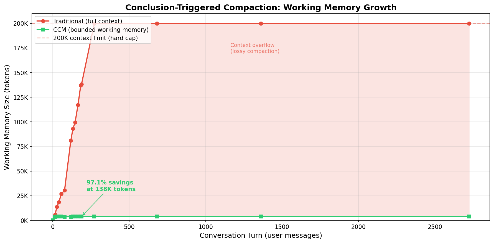

# CCM Comparison Data

Real-world comparison between traditional context management and Conclusion-Triggered Compaction (CCM), using an actual Claude Code conversation.

## Source Conversation

**File**: `d7623174-b82f-45c9-b73b-8c878ff9d7a9.jsonl`
**Project**: Knowledge Network
**Raw size**: 138,219 tokens (20MB JSONL)
**Messages**: 12,080 total, 188 user messages
**Context overflows**: 10 (Claude Code compaction events)
**Effort phases**: 11 distinct topic boundaries

## Effort Boundary Annotations

| # | Effort ID | Msgs | Raw Tokens | Summary Tokens | Savings | Topic |
|---|-----------|------|-----------|----------------|---------|-------|
| 1 | dev-agent-context | 1-15 | 5,861 | 221 | 96% | Targeted context for dev-agent, model selection |
| 2 | session-continuation-tests | 16-27 | 7,944 | 209 | 97% | Dev-agent passing tests, QA verification |
| 3 | scenario-agent-fix | 28-40 | 4,732 | 291 | 94% | Scenario vs story confusion, effort detection |
| 4 | acceptance-test-mocking | 41-56 | 8,471 | 182 | 98% | Real LLM vs mocking debate, tech spec docs |
| 5 | worktree-merge-monitor | 57-77 | 3,462 | 141 | 96% | Worktree branch merging, monitor server |
| 6 | test-arch-story-review | 78-118 | 50,635 | 201 | 100% | Test architect flaws, story reviewer |
| 7 | ccm-e2e-detection | 119-132 | 12,051 | 195 | 98% | Claude Code comparison, e2e detection |
| 8 | stub-problem-detection | 133-146 | 6,386 | 202 | 97% | Stub validator gap, detection approaches |
| 9 | ccm-slice-redesign | 147-165 | 17,662 | 216 | 99% | CCM architecture, whitepaper goals |
| 10 | cli-implementation | 166-183 | 19,956 | 219 | 99% | CLI implementation, effort detection |
| 11 | results-planning | 184-188 | 1,052 | 141 | 87% | Compaction savings, slice planning |
| | **Totals** | | **138,212** | **2,218** | **98.4%** | |

**Average summary**: 202 tokens (LLM-generated via DeepSeek)

## Measured Comparison

### Growth Curve (Working Memory vs Turn)



| Turn | Traditional | CCM | Ratio | Active Efforts | Evicted |
|------|------------|-----|-------|----------------|---------|
| 15 | 5,861 | 3,721 | 2x | 1 | 0 |
| 27 | 13,805 | 3,930 | 4x | 2 | 0 |
| 40 | 18,537 | 4,000 | 5x | 2 | 1 |
| 56 | 27,008 | 3,973 | 7x | 2 | 2 |
| 77 | 30,470 | 3,641 | 8x | 1 | 4 |
| 118 | 81,105 | 3,701 | 22x | 1 | 5 |
| 132 | 93,156 | 3,896 | 24x | 2 | 5 |
| 146 | 99,542 | 3,897 | 26x | 2 | 6 |
| 165 | 117,204 | 3,918 | 30x | 2 | 7 |
| 183 | 137,160 | 3,935 | 35x | 2 | 8 |
| 188 | 138,212 | 3,860 | 36x | 2 | 9 |

### At Conversation End (Turn 188)

| Metric | Traditional | CCM |
|--------|------------|-----|
| Working memory | 138,219 tokens | 4,076 tokens |
| **Savings** | — | **97.1%** |
| Active summaries | N/A | 3 (576 tokens) |
| Ambient window | Full raw log | Last 10 exchanges (~2K tokens) |
| System prompt + tools | ~1,500 | ~1,500 |
| Evicted (retrievable via search) | N/A | 8 efforts |
| Information loss | Lossy (10 compaction events) | Zero (all raw logs preserved) |

### Extrapolated at Scale

| Conversation Length | Traditional | CCM | Savings |
|---------------------|------------|-----|---------|
| 50K tokens | 50K | ~4K | 92% |
| 138K tokens (measured) | 138K | 4K | 97.1% |
| 500K tokens | 200K (hard cap) | ~4K | 98% |
| 2M tokens | 200K (hard cap, severe loss) | ~4K | 98% |

### The Math

```
Traditional: min(total_tokens, 200K)  — linear growth, hard cap, lossy above limit

CCM:  active_summaries + ambient_window + system_prompt
    = (2-3 summaries * 202 avg) + (10 exchanges * 2 * 100) + 1500
    = ~500 + 2000 + 1500
    = ~4,000 tokens (constant — O(1) regardless of conversation length)
```

**Key insight**: Traditional context is O(n) capped at 200K. CCM working context is O(1) — bounded by eviction threshold and ambient window. The difference compounds: at 138K tokens it's 36x; extrapolated to 2M tokens it would be ~50x.

## Methodology

- **Segmentation**: 11 effort phases identified by analyzing user message content and topic transitions
- **Summaries**: Generated by DeepSeek (deepseek-chat) using the same `summarize_effort` function CCM uses in production
- **Token estimation**: Character count / 4 (standard English approximation)
- **CCM parameters**: SUMMARY_EVICTION_THRESHOLD=20 turns, AMBIENT_WINDOW=10 exchanges
- **Scripts**: `scripts/ccm_comparison.py` (data generation), `scripts/ccm_chart.py` (visualization)
- **Raw results**: `docs/research/ccm-comparison-results.json`
